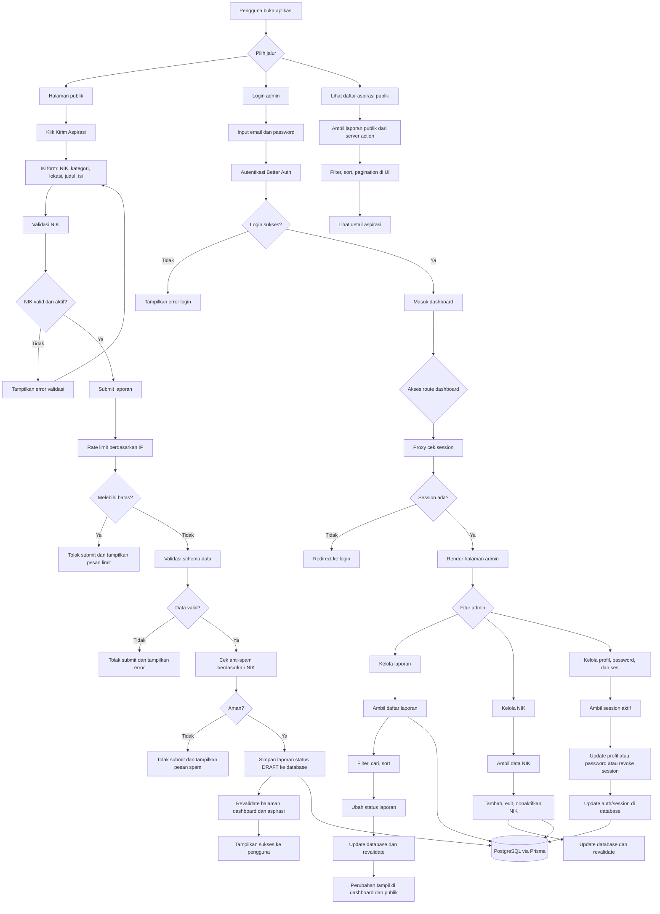
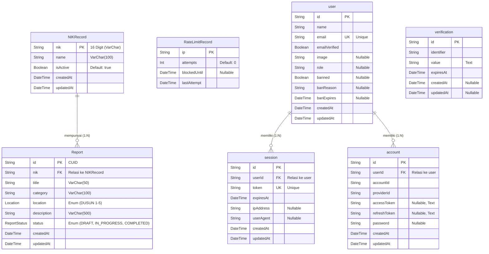

# 🏛️ LASMATA - *L*ayanan *A*spira*S*i *M*asyarakat Des*A* *T*embal*A*e

Platform transparansi publik berbasis web untuk menyampaikan aspirasi, keluhan, dan saran pembangunan untuk Desa Tembalae. Proyek ini dikembangkan untuk memfasilitasi komunikasi digital yang terintegrasi antara masyarakat dan instansi pemerintahan desa.

---

## 📋 Tentang Proyek

LASMATA (Layanan Aspirasi Masyarakat Desa Tembalae) adalah sistem manajemen aspirasi masyarakat yang dirancang untuk mengikuti alur kerja layanan publik desa secara langsung: warga mengirim aspirasi, data divalidasi, laporan disimpan, lalu admin menindaklanjuti dan memperbarui statusnya.

### 🎯 Tujuan Utama

- **Transparansi**: Menyediakan akses publik terhadap aspirasi yang masuk dan memantau status penanganannya.
- **Partisipasi**: Memudahkan warga menyampaikan keluhan atau saran dari mana saja melalui perangkat *mobile* maupun *desktop*.
- **Akuntabilitas**: Membantu pemerintah desa dalam mendokumentasikan dan menindaklanjuti aspirasi masyarakat secara terstruktur.
- **Validitas**: Memastikan laporan yang masuk berasal dari warga asli desa melalui sistem verifikasi Nomor Induk Kependudukan (NIK).

## 🧭 Alur Program

### 1. Akses Publik
- Pengguna membuka halaman utama LASMATA.
- Halaman utama menampilkan informasi layanan, tombol kirim aspirasi, dan elemen pendukung seperti navigasi, fitur, testimoni, dan FAQ.
- Pengguna juga bisa membuka halaman daftar aspirasi publik untuk melihat laporan yang sudah masuk.

### 2. Pengajuan Aspirasi
- Pengguna mengisi form aspirasi dengan NIK, kategori, lokasi, judul, dan isi laporan.
- Sistem memvalidasi NIK terlebih dahulu melalui data master NIK.
- Jika NIK valid dan aktif, laporan dikirim ke server.
- Server menjalankan validasi schema, rate limit, dan pengecekan anti-spam sebelum menyimpan data.
- Laporan baru disimpan dengan status `DRAFT`, lalu halaman publik dan dashboard di-*revalidate*.

### 3. Daftar Aspirasi Publik
- Halaman aspirasi publik mengambil data laporan dari server action.
- Data ditampilkan dengan fitur filter, sort, pagination, dan detail laporan.
- Status laporan ditampilkan dalam bahasa pengguna seperti Draft, Diproses, dan Diselesaikan.

### 4. Login Admin
- Admin membuka halaman login.
- Sistem autentikasi menggunakan Better Auth melalui endpoint `/api/auth/[...all]`.
- Jika login berhasil, pengguna diarahkan ke dashboard admin.
- Proxy/guard route memastikan halaman dashboard hanya bisa diakses saat sesi aktif tersedia.

### 5. Dashboard Admin
- Dashboard utama menampilkan statistik laporan.
- Admin dapat membuka halaman manajemen laporan untuk mencari, memfilter, dan mengubah status laporan.
- Admin juga dapat membuka halaman manajemen NIK untuk menambah, mengubah, atau menonaktifkan NIK.
- Admin dapat mengelola profil, password, dan sesi login yang aktif.

### 6. Database dan Sinkronisasi
- Semua data inti tersimpan di PostgreSQL melalui Prisma.
- Perubahan pada laporan, NIK, profil, atau sesi memicu revalidation agar tampilan publik dan dashboard tetap sinkron.

## ✨ Fitur Utama

### Untuk Masyarakat
- 📝 **Pengajuan Aspirasi Online** - Formulir pengajuan dengan validasi NIK terdaftar.
- 🔍 **Tracking Status** - Melihat status penanganan aspirasi dari Draft sampai Diselesaikan.
- 📊 **Dashboard Publik** - Transparansi daftar aspirasi yang telah masuk.
- 🌓 **Dark/Light Mode** - Antarmuka yang nyaman di mata dengan dukungan mode gelap dan terang.

### Untuk Administrator (Perangkat Desa)
- 🔐 **Autentikasi Aman** - Login admin terlindungi menggunakan Better Auth.
- 📊 **Dashboard Admin** - Statistik dan ikhtisar seluruh laporan yang masuk.
- ✅ **Manajemen Status Laporan** - Memperbarui status tindak lanjut laporan warga.
- 👥 **Manajemen Master NIK** - Menambah, mengedit, dan mengelola database NIK warga yang diizinkan melapor.
- 🔒 **Manajemen Akun** - Pembaruan profil, kata sandi, dan sesi administrator.

---

## 🚀 Cara Kerja Platform


## 🛠️ Tech Stack (Teknologi yang Digunakan)

### Frontend
- **Framework**: Next.js 16 (App Router)
- **Language**: TypeScript
- **UI Library**: shadcn/ui (Radix UI)
- **Styling**: Tailwind CSS v4
- **Animation**: Framer Motion
- **Icons**: Lucide React
- **Theme**: next-themes (Dark/Light mode)

### Backend & Database
- **Database**: PostgreSQL (Hosted on Neon)
- **ORM**: Prisma v7.4.1
- **Authentication**: Better Auth
- **Password Hashing**: bcryptjs

### Development Tools
- **Runtime & Package Manager**: Node.js & Bun
- **Linting**: ESLint 9

---

## 📊 Database Schema Overview


## 🚀 Setup & Instalasi Lokal

### Prasyarat
- Node.js & **Bun** terinstal di komputer.
- Akun [Neon.tech](https://neon.tech/) untuk *database* PostgreSQL.
- Akun GitHub.

### Langkah Instalasi

1. **Clone Repository**
   ```bash
   git clone [https://github.com/username-anda/lasmata-web.git](https://github.com/username-anda/lasmata-web.git)
   cd lasmata-web

2. **Install Dependencies**
   ```bash
   npm install
   atau menggunakan bun
   bun install
   
3. **Setup Environment Variables**
   ```bash
    - Database Configuration (Dapatkan dari dashboard Neon)
    DATABASE_URL="postgresql://[user]:[password]@[host]/[dbname]?sslmode=require"
    
    - Setup Admin Pertama (Untuk Seeding)
    SEED_ADMIN_EMAIL="admin@desakita.id"
    SEED_ADMIN_PASSWORD="ganti-password-sebelum-seed"
    SEED_ADMIN_NAME="Administrator"
   
4. **Setup Database (Prisma)**
   ```bash
    bun run db:generate
    bun run db:migrate

   - Masukkan data dummy / admin awal ke database:
    bun run db:seed
    
5. **Jalankan Development Server**
   ```bash
   bun run dev / bun dev
   atau menggunakan npm
   npm run dev

6. **Akses Aplikasi**
   
    Halaman Warga: http://localhost:3000
    Halaman Login Admin: http://localhost:3000/login

7. **Daftar Perintah (Scripts)**
   ```bash
    bun run dev           # Menjalankan server lokal (localhost:3000)
    bun run build         # Mem-build aplikasi untuk production
    bun run db:generate   # Meng-generate Prisma Client
    bun run db:migrate    # Menjalankan migrasi database ke Neon
    bun run db:seed       # Memasukkan akun admin dari file .env ke database
    bun run db:studio     # Membuka UI Prisma Studio untuk melihat isi database

## 🤝 Kepemilikan & Pengembangan
Proyek LASMATA (Layanan Aspirasi Masyarakat Desa Tembalae) ini dikembangkan oleh:

#### Dayang Aisyah, Wa Nanda Sulystrian & M. Ray Togubu - Universitas Muhammadiyah Makassar

Produk ini diajukan untuk memenuhi persyaratan Product/project Tugas Kampus.
