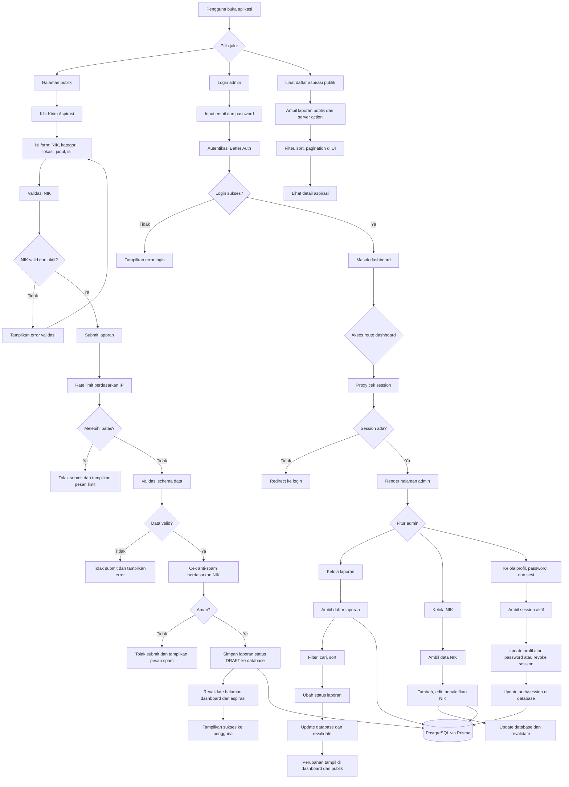
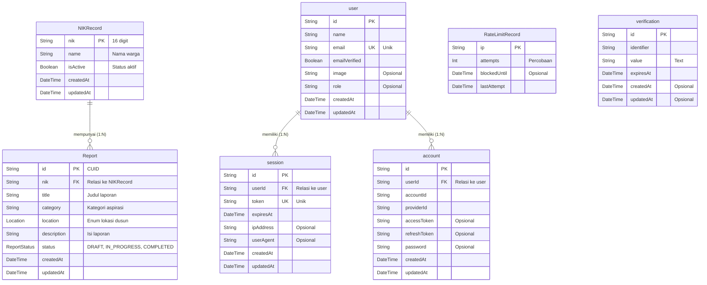

# 🏛️ LASMATA - *L*ayanan *A*spira*S*i *M*asyarakat Des*A* *T*embal*A*e

LASMATA adalah aplikasi web layanan aspirasi masyarakat Desa Tembalae yang memungkinkan warga mengirim laporan berbasis NIK, melihat daftar aspirasi publik, dan memberi ruang bagi admin untuk menindaklanjuti laporan melalui dashboard terproteksi.

---

## 📋 Deskripsi Aplikasi

LASMATA dibangun dengan Next.js App Router dan server action agar proses pengajuan aspirasi, validasi NIK, penyimpanan laporan, dan manajemen admin berjalan dalam satu sistem yang terpadu. Aplikasi ini memisahkan pengalaman pengguna publik dan admin, tetapi keduanya memakai sumber data yang sama di PostgreSQL melalui Prisma.

## 🎯 Tujuan Program

- **Transparansi**: Menyediakan daftar aspirasi publik yang dapat dipantau oleh masyarakat.
- **Validasi identitas**: Memastikan laporan hanya bisa dikirim dari NIK yang terdaftar dan aktif.
- **Pelayanan terstruktur**: Membantu admin mengelola laporan, status tindak lanjut, dan data NIK secara rapi.
- **Sinkronisasi data**: Menjaga perubahan laporan dan NIK langsung tercermin di halaman publik dan dashboard.

## ✨ Fitur Utama

### Untuk Masyarakat
- 📝 **Form Aspirasi Online** - Pengajuan laporan dengan input NIK, kategori, lokasi, judul, dan isi.
- 🔍 **Validasi NIK** - NIK dicek sebelum laporan dikirim ke server.
- 📊 **Daftar Aspirasi Publik** - Pengguna dapat melihat laporan yang sudah masuk.
- 🌓 **Mode Tema** - Dukungan mode terang dan gelap.

### Untuk Administrator
- 🔐 **Login Aman** - Autentikasi admin menggunakan Better Auth.
- 📊 **Dashboard Admin** - Ringkasan statistik laporan.
- ✅ **Manajemen Laporan** - Admin dapat mengubah status laporan menjadi DRAFT, IN_PROGRESS, atau COMPLETED.
- 👥 **Manajemen NIK** - Admin dapat menambah, mengubah, dan menonaktifkan NIK.
- 🔒 **Manajemen Sesi dan Profil** - Admin dapat mengelola profil, password, dan sesi login.

## 🧭 Alur Program

### 1. Akses Publik
- Pengguna membuka halaman utama LASMATA.
- Halaman utama menampilkan informasi layanan, tombol kirim aspirasi, dan elemen pendukung seperti navigasi, fitur, testimoni, dan FAQ.
- Pengguna juga bisa membuka halaman daftar aspirasi publik untuk melihat laporan yang sudah masuk.

### 2. Pengajuan Aspirasi
- Pengguna mengisi form aspirasi dengan NIK, kategori, lokasi, judul, dan isi laporan.
- Sistem memvalidasi NIK terlebih dahulu melalui data master NIK.
- Jika NIK valid dan aktif, laporan dikirim ke server.
- Server menjalankan validasi schema, rate limit, dan pengecekan anti-spam sebelum menyimpan data.
- Laporan baru disimpan dengan status `DRAFT`, lalu halaman publik dan dashboard di-*revalidate*.

### 3. Daftar Aspirasi Publik
- Halaman aspirasi publik mengambil data laporan dari server action.
- Data ditampilkan dengan fitur filter, sort, pagination, dan detail laporan.
- Status laporan ditampilkan dalam bahasa pengguna seperti Draft, Diproses, dan Diselesaikan.

### 4. Login Admin
- Admin membuka halaman login.
- Sistem autentikasi menggunakan Better Auth melalui endpoint `/api/auth/[...all]`.
- Jika login berhasil, pengguna diarahkan ke dashboard admin.
- Proxy/guard route memastikan halaman dashboard hanya bisa diakses saat sesi aktif tersedia.

### 5. Dashboard Admin
- Dashboard utama menampilkan statistik laporan.
- Admin dapat membuka halaman manajemen laporan untuk mencari, memfilter, dan mengubah status laporan.
- Admin juga dapat membuka halaman manajemen NIK untuk menambah, mengubah, atau menonaktifkan NIK.
- Admin dapat mengelola profil, password, dan sesi login yang aktif.

### 6. Database dan Sinkronisasi
- Semua data inti tersimpan di PostgreSQL melalui Prisma.
- Perubahan pada laporan, NIK, profil, atau sesi memicu revalidation agar tampilan publik dan dashboard tetap sinkron.

## ✨ Fitur Utama

### Untuk Masyarakat
- 📝 **Pengajuan Aspirasi Online** - Formulir pengajuan dengan validasi NIK terdaftar.
- 🔍 **Tracking Status** - Melihat status penanganan aspirasi dari Draft sampai Diselesaikan.
- 📊 **Dashboard Publik** - Transparansi daftar aspirasi yang telah masuk.
- 🌓 **Dark/Light Mode** - Antarmuka yang nyaman di mata dengan dukungan mode gelap dan terang.

### Untuk Administrator (Perangkat Desa)
- 🔐 **Autentikasi Aman** - Login admin terlindungi menggunakan Better Auth.
- 📊 **Dashboard Admin** - Statistik dan ikhtisar seluruh laporan yang masuk.
- ✅ **Manajemen Status Laporan** - Memperbarui status tindak lanjut laporan warga.
- 👥 **Manajemen Master NIK** - Menambah, mengedit, dan mengelola database NIK warga yang diizinkan melapor.
- 🔒 **Manajemen Akun** - Pembaruan profil, kata sandi, dan sesi administrator.

---

## 🚀 Cara Kerja Platform


## 🛠️ Teknologi yang Digunakan

### Frontend
- **Framework**: Next.js 16 (App Router)
- **Language**: TypeScript
- **UI Library**: shadcn/ui berbasis Radix UI
- **Styling**: Tailwind CSS v4
- **Animation**: Framer Motion
- **Icons**: Lucide React
- **Theme**: next-themes
- **Notifikasi**: Sonner

### Backend & Database
- **Database**: PostgreSQL
- **ORM**: Prisma v7.4.1
- **Auth**: Better Auth dengan plugin multi-session dan admin role
- **Adapter database**: Prisma Adapter untuk Neon
- **Validasi**: Zod
- **Proteksi data**: Rate limiter dan spam checker di server action

### Development Tools
- **Runtime**: Node.js
- **Package manager**: Bun atau npm
- **Linting**: ESLint 9

---

## 📊 Schema Database

Struktur database inti LASMATA terdiri dari tabel aspirasi, master NIK, pembatasan permintaan, dan tabel autentikasi Better Auth.



## 🚀 Setup & Instalasi Lokal

### Prasyarat
- Node.js 20+ atau Bun.
- Database PostgreSQL, disarankan Neon.
- Variabel lingkungan untuk Better Auth dan database.

### Langkah Instalasi

1. **Clone Repository**
   ```bash
   git clone https://github.com/105841109822/LASMATA.git
   cd LASMATA
   ```

2. **Install Dependencies**
   ```bash
   bun install
   ```
   Jika memakai npm:
   ```bash
   npm install
   ```

3. **Setup Environment Variables**
   ```bash
   DATABASE_URL="postgresql://[user]:[password]@[host]/[dbname]?sslmode=require"
   BETTER_AUTH_URL="http://localhost:3000"
   BETTER_AUTH_SECRET="ganti-dengan-secret-yang-kuat"
   SEED_ADMIN_EMAIL="admin@desakita.id"
   SEED_ADMIN_PASSWORD="ganti-password-sebelum-seed"
   SEED_ADMIN_NAME="Administrator"
   ```

4. **Setup Database (Prisma)**
   ```bash
   bun run db:generate
   bun run db:migrate
   bun run db:seed
   ```
   Jika ingin memakai migrasi production:
   ```bash
   bun run db:migrate:prod
   ```

5. **Jalankan Development Server**
   ```bash
   bun run dev
   ```
   Atau dengan npm:
   ```bash
   npm run dev
   ```

6. **Akses Aplikasi**
   - Halaman utama: http://localhost:3000
   - Halaman aspirasi publik: http://localhost:3000/aspirasi
   - Halaman login admin: http://localhost:3000/login

7. **Daftar Perintah (Scripts)**
   ```bash
   bun run dev             # Menjalankan server lokal
   bun run build           # Generate Prisma client lalu build production
   bun run start           # Menjalankan aplikasi production
   bun run lint            # Menjalankan ESLint
   bun run db:generate     # Meng-generate Prisma Client
   bun run db:migrate      # Menjalankan migrasi database
   bun run db:migrate:prod # Menjalankan migrasi production
   bun run db:seed         # Menjalankan seed admin, NIK, dan laporan contoh
   bun run db:studio       # Membuka Prisma Studio
   ```

## 🤝 Kepemilikan & Pengembangan
Proyek LASMATA (Layanan Aspirasi Masyarakat Desa Tembalae) ini dikembangkan oleh:

#### Dayang Aisyah, Wa Nanda Sulystrian, M. Ray Togubu & Baso Hamzah - Universitas Muhammadiyah Makassar

Produk ini diajukan untuk memenuhi persyaratan Product/project Tugas Kampus.
